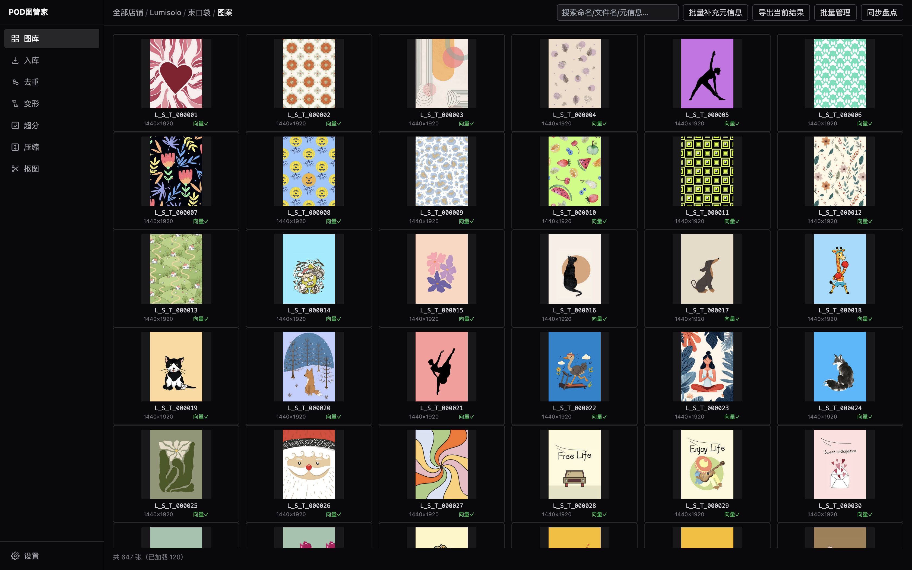
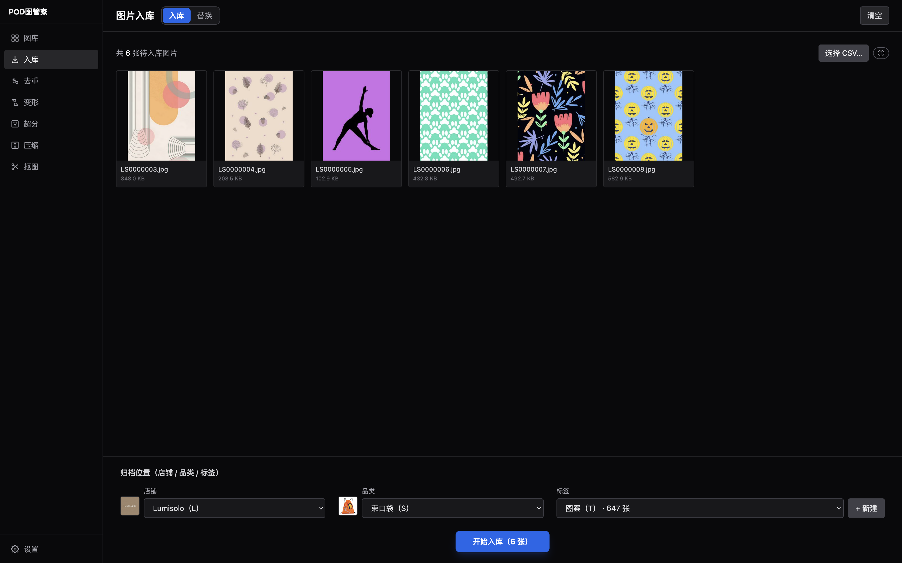
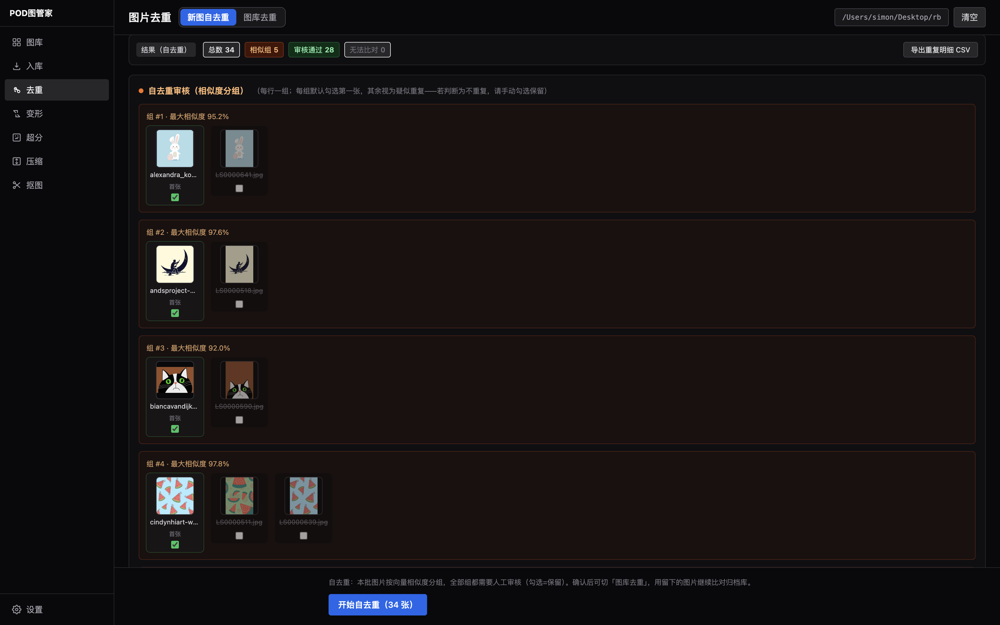
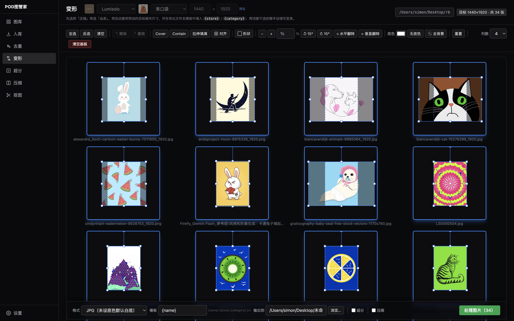
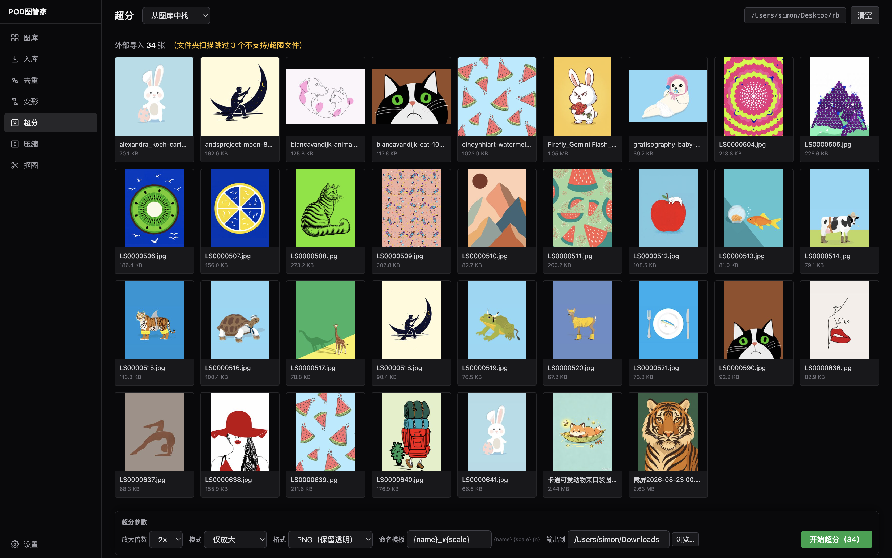
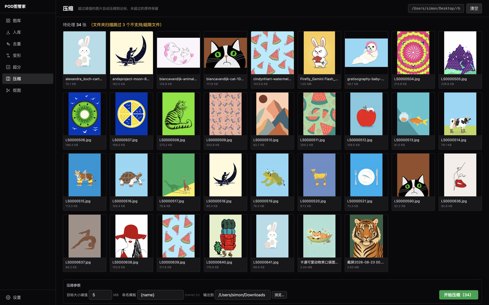
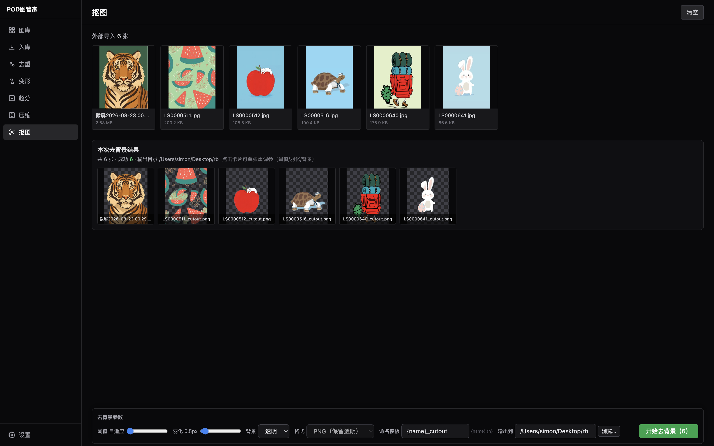

# POD图管家 · 用户使用手册

> 专为 Temu POD 电商从业者打造的一站式图案图库管理桌面应用。
> 向量去重 · 图形转换 · 智能抠图 · 超分放大 · 批量压缩 · 一键入库，全流程本地离线运行。

**下载地址**：[https://github.com/Le-Fu/pod-tuguajia/releases/latest](https://github.com/Le-Fu/pod-tuguajia/releases/latest)
**问题反馈**：[https://github.com/Le-Fu/pod-tuguajia/issues](https://github.com/Le-Fu/pod-tuguajia/issues)

---

## 目录

- [一、安装与更新](#一安装与更新)
- [二、首次配置](#二首次配置)
- [三、功能模块总览](#三功能模块总览)
- [四、图库管理](#四图库管理)
- [五、一键入库](#五一键入库)
- [六、智能去重](#六智能去重)
- [七、变形（图形转换）](#七变形图形转换)
- [八、超分放大](#八超分放大)
- [九、图片压缩](#九图片压缩)
- [十、抠图（去背景）](#十抠图去背景)
- [十一、设置](#十一设置)
- [十二、常见问题 FAQ](#十二常见问题-faq)

---

## 一、安装与更新

### 系统要求

- **macOS 10.15+**（提供 Intel x64 安装包，Apple Silicon 通过 Rosetta 2 运行）
- 磁盘空间 ≥ 2GB（含本地 AI 模型），安装包约 180MB

### 安装步骤

1. 前往 [Releases 页面](https://github.com/Le-Fu/pod-tuguajia/releases/latest) 下载 `POD ImageVault-x.x.x-mac-x64.dmg`
2. 双击打开 dmg，将 **POD图管家** 拖入「应用程序」文件夹
3. 首次打开：在「应用程序」中**右键点击应用图标 → 选择「打开」** → 弹窗中再点「打开」
   （应用未做苹果开发者签名，直接双击会提示"无法验证开发者"，右键打开一次即可）
4. 首次启动约 3 秒加载本地模型，之后进入主界面

### 自动更新

应用内置自动更新（基于 GitHub Releases）：

- 打开 **设置 → 关于 → 检查更新**
- 发现新版本后点「下载更新」，下载完成后「安装并重启」即可
- 更新不会丢失你的图库数据（数据保存在系统用户目录，与应用本体分离）

---

## 二、首次配置

开始使用前，建议先完成以下配置（均在「设置」页）：

1. **设置图库根目录**：选择一个专门存放图库的文件夹（所有图片、缩略图、数据库都在其中，便于备份）
2. **创建店铺与品类**：设置 → 资源分类管理 → 店铺 / 品类
   - 品类隶属于店铺，每个品类可设置**预设尺寸**（变形模块会用到）
   - 店铺码、品类码为 1-2 个大写字母（如店铺 `A`、品类 `T`），用于自动命名
3. **模型配置**（默认本地模型即可离线使用）：
   - 嵌入模型：默认「本地 CLIP ViT-B/32」，用于向量去重
   - 超分模型 / 去背景模型：默认本地 ONNX，也可配置云端 API（火山 / 阿里）提速

---

## 三、功能模块总览

左侧边栏共 7 个模块（自上而下）：

| 顺序 | 模块 | 作用 |
|----|------|------|
| 1 | **图库** | 浏览/管理已入库的图片（店铺→品类→标签→图片四级导航） |
| 2 | **入库** | 把新图片批量归档进图库（自动命名 + 向量入库） |
| 3 | **去重** | 新图之间、新图与图库之间的相似度查重 |
| 4 | **变形** | 批量裁剪/旋转/对齐/换底，导出符合平台尺寸的成品图 |
| 5 | **超分** | 低清图片放大增强（2/3/4 倍） |
| 6 | **压缩** | 批量把图片压到目标体积以下 |
| 7 | **抠图** | 智能去除图片背景，输出透明底素材 |

> 💡 典型流程：**入库前去重 → 抠图/变形处理 → 超分/压缩 → 入库归档 → 图库浏览**

---

## 四、图库管理

- **四级层级导航**：店铺 → 品类 → 标签 → 图片，顶部面包屑可跳级切换
- **虚拟滚动网格**：单图库支持上万张图片，滚动流畅
- **图片详情**：点击图片可查看/编辑 产品ID、标题、元素描述、备注 等元信息
- **多选操作**：点击选中，Shift+点击 区间多选，支持批量操作
- **封面托管**：可为店铺、品类设置封面图
- **同步盘点**：可补录磁盘上存在但未登记到数据库的文件

---

## 五、一键入库

把处理好的图片批量归档进图库。

1. **导入图片**：整页拖入文件夹 / 零散图片，或点击虚线框选择文件夹
2. **选择店铺与品类**：入库目标位置
3. **确认去重已完成**：入库前系统会提示先完成去重检查，避免重复图入库
4. **开始入库**：
   - 自动按 `店码_品码_6位序号` 命名（如 `A_T_000001.jpg`），序号严格递增、不重号
   - 自动计算哈希（精确去重）+ 生成向量（语义检索）
   - 任务支持崩溃续传，中断后重新进入可继续

---

## 六、智能去重

基于 CLIP ViT-B/32 的 **512 维向量余弦相似度**检索，裁剪、旋转、轻微变色仍能识别为相似。

### 两种去重模式

- **自去重**：检查本批新图**彼此之间**是否重复
- **图库去重**：检查新图与**图库里已有图片**是否重复（命中范围 = 目标店铺全品类 + 其他店铺所选品类）

### 审核方式

- **列表态**：快速浏览所有重复组
- **全屏态**：左侧看新图大图，右侧看相似图网格，逐组审核决策

### 操作与快捷键

| 按键 | 作用 |
|------|------|
| `Enter` | 保留当前新图 |
| `E` | 丢弃当前新图 |
| `←` / `→` | 上一组 / 下一组 |
| `Esc` | 退出全屏 / 关闭大图预览 |

- 相似度配色：**≥92% 红色**（高度重复）、**≥85% 橙色**、其余黄色
- 右侧相似图网格可调整每行张数（1-8），点击卡片查看大图
- **确认并导出**：按审核结果导出图片；也可导出 **CSV 详情表**（含硬拦截/灰区复核/自去重组等分区）

> ⚠️ 去重不会自动删图，所有组都需要人工勾选「保留/丢弃」后再导出。

---

## 七、变形（图形转换）

批量把图案处理成符合平台要求的成品图，基于 Canvas 画板，所见即所得。

### 基本流程

1. **导入图片**：拖入文件夹/图片，或点击选择
2. **选择店铺与品类**：
   - 选了店铺+品类 → 自动加载该品类的**预设尺寸**（只读）
   - 都不选 → 手动输入目标宽高
3. 每张图进入独立**正方形画板**，中间虚线框为裁剪区域（画板边长的 60%）
4. 用工具栏调整，满意后**勾选要导出的画板** → 底部栏导出

### 工具栏功能

- **选择**：全选 / 反选 / 清空（只导出勾选的画板）
- **布局**：Cover（填满裁剪框）/ Contain（完整显示）/ 拉伸填满 / 居中
- **对齐**：3×3 九宫格，9 种对齐方式
- **旋转**：顺时针/逆时针 15° 步进、水平翻转、垂直翻转，也可输入任意角度或鼠标拖拽
- **缩放**：+/- 按钮或直接输入百分比
- **底色**：可为每张图设置背景色（JPG 默认白底、PNG 默认透明）
- **重置**：单张画板恢复初始状态
- **撤销/重做**：`Ctrl+Z` / `Ctrl+Shift+Z`

### 导出

- 格式：**PNG / JPG**
- 文件名模板支持变量：`{name}`（原文件名）、`{store}`（店铺）、`{category}`（品类）、`{n}`（序号）
- 可选**压缩**：导出时自动压到设定体积以下
- 50 张图同屏不卡：预览用代理图、导出由 Worker 用原图处理
- **二次确认**：点击【处理图片】会先弹层提示已选数量与输出目录，确认后才提交任务
- **导航守卫**：处理过程中切换页面会弹层确认，避免误离开中断任务
- **损坏文件隔离**：遇到损坏或不支持格式的图片时，单文件错误不会中断整个会话，会被收集到"跳过"列表

---

## 八、超分放大

把低分辨率图片放大增强，提升清晰度。

- **放大倍数**：2 / 3 / 4 倍
- **图片来源**（三选一）：
  - 从**图库**选图：选择店铺（+品类）后，可按文件名搜索，勾选图片
  - **文件夹导入**：选择整个文件夹
  - **拖拽**：直接拖入零散图片
- **模型**：设置 → 模型配置 → 超分模型
  - 本地 ONNX（推荐，离线、免费）
  - 火山云 / 阿里云图像超分（速度快，需 API Key）
  - 自定义 HTTP 接口
- 后台任务执行，实时反馈进度
- 输出目录会自动记忆，下次默认使用上次位置

> 💡 图库选图超过 200 张时仅显示前 200 张，请用搜索缩小范围。

---

## 九、图片压缩

批量把图片体积压到目标阈值以下，满足上传大小限制。

1. 导入图片（拖入文件夹/图片或点击选择）
2. 底部设置**压缩阈值**（默认 5MB）和**文件名模板**
3. 选择输出目录 → 开始压缩

### 压缩规则

- **≤ 阈值**的图片：原样复制，不重复压缩（无损保留）
- **> 阈值**的图片：
  - JPG：质量阶梯压缩（90→50）+ 智能估算边长，mozjpeg 编码
  - PNG：调色板量化，**保留透明通道**；实在压不到阈值会提示改用 JPG
- 结果区展示：压缩/保留/失败数量、节省空间、总压缩率、逐张前后对比
- 独立压缩页超阈值的 JPG 统一输出**白底 JPG**

---

## 十、抠图（去背景）

智能去除图片背景，输出透明底素材，方便后续换底、排版。

- **图片来源**：图库筛选 / 文件夹 / 拖拽，三种方式均可批量
- **本地 U2Net 模型**批量抠图，离线可用（也可在 设置 → 模型配置 → 去背景模型 中切换云端接口）
- 输出**透明 PNG**，可选**纯色背景填充**
- 结果区支持**单张重调参**：阈值 / 羽化 / 背景色，并提供前后对比预览
- 处理后可结合「变形」模块换底、排版后导出成品图

---

## 十一、设置

| 分类 | 内容 |
|------|------|
| **模型配置** | 嵌入模型（本地CLIP/火山/阿里/腾讯）、超分模型、去背景模型；云端需填 API Key（本地加密存储） |
| **资源分类管理** | 店铺 / 品类（挂店铺，可设预设尺寸）/ 标签；可设置封面图 |
| **协作与连接** | 主从模式：同一局域网内多台设备可连接主机共享图库（mDNS 自动发现）；主机下线/网络中断时从机自动进入"失联"状态并持续重连，主机恢复后自动恢复连接，无需手动断开重连 |
| **数据优化** | 数据库维护、向量索引优化 |
| **日志管理** | 查看 / 导出日志文件，排查问题时使用 |
| **关于** | 版本号、检查更新 |

---

## 十二、常见问题 FAQ

**Q：打开提示"无法验证开发者 / 已损坏"？**
A：应用未签名。在「应用程序」中**右键点图标 → 打开 → 再点打开**即可；若仍提示损坏，终端执行 `xattr -cr /Applications/POD\ ImageVault.app` 后重试。

**Q：升级后我的图库还在吗？**
A：在。数据存于系统用户目录（`~/Library/Application Support/pod-image-vault/`），更新应用不影响数据。

**Q：去重/超分/抠图必须联网吗？**
A：不必。默认使用本地 ONNX 模型，完全离线；配置云端 API 仅为提速可选。

**Q：入库时提示"请先完成去重"？**
A：这是防重复保护。请先到「去重」模块检查本批图片，确认无重复后再入库。

**Q：变形导出的图被裁掉了？**
A：裁剪以中间虚线框为准，框外内容不导出。可用 Contain 布局或缩放/对齐调整图案位置，确保主体在框内。

**Q：从机提示"与主机失去连接"怎么办？**
A：从机每 15 秒做一次心跳检测，连续 3 次失败会自动切换到"失联"状态（顶部 amber banner 提示），此时数据仍可只读浏览，写操作会被拦截。等主机恢复后会自动重连并刷新数据，无需手动操作；如需立即切回本机模式，可去「设置 → 协作与连接」点【断开连接】。

**Q：PNG 压缩后还是很大？**
A：PNG 是无损格式，复杂图案压缩率有限。如无需透明背景，导出时选 JPG 可显著减小体积。

**Q：多台电脑能共用一个图库吗？**
A：可以。设置 → 协作与连接，一台作为主机，其余设备在同一局域网内连接即可（从机自动发现主机）。

**Q：遇到 Bug 怎么办？**
A：到 [Issues](https://github.com/Le-Fu/pod-tuguajia/issues) 反馈，并可在 设置 → 日志管理 导出日志附上，便于定位。

---

*本手册随版本持续更新，当前对应版本 v0.1.9。*
